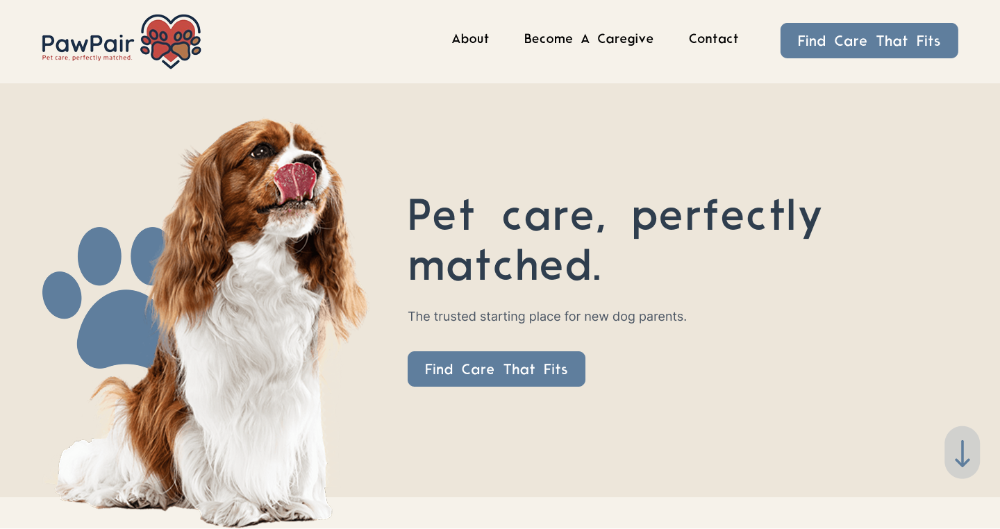

# PawPair 🐾

> **Pet care, perfectly matched.**  
> A compatibility-based dog care matchmaking platform that connects dog owners with trusted caregivers.

---

## What is PawPair?

PawPair is an Airbnb-style marketplace built specifically for dog care. Instead of manual browsing, PawPair runs a **5-dimension compatibility algorithm** that matches dogs to caregivers based on size, temperament, location, energy level, and experience — giving every match a score and a compatibility tier (High / Medium / Low).

---

## Tech Stack

| Layer | Technology |
|---|---|
| **Framework** | [Next.js 15](https://nextjs.org/) — App Router, Server Components, Server Actions |
| **Language** | TypeScript |
| **Styling** | [Tailwind CSS](https://tailwindcss.com/) |
| **Database** | [Supabase](https://supabase.com/) (PostgreSQL) with Row Level Security |
| **Auth** | Supabase Auth — PKCE flow, email confirmation, JWT sessions |
| **Animations** | [GSAP](https://gsap.com/) + ScrollTrigger |
| **PWA** | [@ducanh2912/next-pwa](https://github.com/DuCanhGH/next-pwa) — installable, offline-ready |
| **Deployment** | [Vercel](https://vercel.com/) |
| **ORM / Client** | `@supabase/ssr` — cookie-based SSR session management |

---

## Features

### Landing Page
- Animated hero section with GSAP scroll-triggered transitions
- "Find Care That Fits" CTA routing to the quiz
- Responsive header with role-based navigation (Become a Caregiver / Find Care)
- PWA manifest + service worker for installability

### Authentication
- **Dog Owner signup** — email + full name, role stored in `raw_user_meta_data`
- **Caregiver signup** — separate application flow with pending-review state
- Email confirmation via PKCE callback (`/auth/callback`)
- Forgot password + update password flow
- Role-based post-login redirect (`/dashboard/owner` or `/dashboard/caregiver`)

### Caregiver Onboarding
- Dedicated onboarding page (`/onboarding/caregiver`) triggered right after email confirmation — outside the dashboard chrome for a focused experience
- 4-step progress tracker (Account created → Complete profile → Under review → Start matching)
- Welcome banner with caregiver's first name
- Full profile form: bio, experience, accepted sizes, temperaments, services, certifications, location, availability
- Skip option — can complete later from dashboard

### Dog Owner Dashboard (`/dashboard/owner`)
- Personalised welcome with first name
- Live stats: Dogs Registered, Matches Found, Active Bookings
- **"Find Care That Fits"** primary CTA button + quiz launcher card
- **My Dogs table** — responsive table listing all registered dogs with:
  - Breed, size badge (colour-coded), age, energy level bar, city, care types
  - Quick-action buttons: View Matches, Run Quiz
- Getting Started guide for new users with no dogs

### Add Dog (`/dashboard/owner/dogs/add`)
- Multi-section form: Basic Info, Personality, Special Needs, Location & Care
- Size radio buttons, energy range slider, temperament multi-select tags
- Care type selection (Boarding, Daycare, Walking, Drop-in)

### My Dogs List (`/dashboard/owner/dogs`)
- Card grid of all registered dogs
- Per-dog: breed, age, size, energy, city, care types
- Links to View Matches and Edit (each dog)

### Owner Matches (`/dashboard/owner/matches`)
- Dog tab switcher when multiple dogs are registered
- Per-match: caregiver name, compatibility tier badge, match status
- 5-dimension score breakdown bar chart (Location, Size, Temperament, Availability, Experience)

### Dog Care Quiz (`/find-care`)
- **Unauthenticated** — landing with "How it works" + Sign up / Sign in CTAs
- **Authenticated owner** — 7-step quiz:
  1. Dog name & breed
  2. Size
  3. Energy level
  4. Temperament (multi-select)
  5. Care type needed
  6. Location & availability
  7. Special needs
- **Existing dog selector** — if dogs already registered, choose a dog to refresh its matches, or add a new one
- Progress bar across all steps
- Calls `submitQuizAndMatch` server action on submit:
  - Creates dog profile in database
  - Scores all approved caregivers across 5 dimensions (0–5 each, max 25)
  - Upserts results into `matches` table
  - Returns top-5 matches with compatibility tiers
- Immediate results display with score breakdown per match

### Caregiver Dashboard (`/dashboard/caregiver`)
- **Pending approval state** — progress checklist + "Complete your profile" CTA
- **Approved state** — stats (Dog Matches, Active Requests, Profile Views) + action cards
- Edit profile link

### Caregiver Matches (`/dashboard/caregiver/matches`)
- Lists all dogs matched to the caregiver
- Owner name, dog details, compatibility tier, score breakdown
- Pending/approved approval state handling

### Caregiver Profile Edit (`/dashboard/caregiver/profile`)
- Same form as onboarding, pre-filled with existing data
- Approval status notice

### Account Settings (Owner & Caregiver)
- Update full name, phone, city
- Change password (re-auth required)
- Danger zone — delete account

---

## Database Schema

```
auth.users          ← Supabase managed
    ↓ trigger
profiles            id · full_name · role · city · phone · created_at
    ↓
dogs                id · owner_id · name · breed · size · age · energy_level
                    temperament[] · special_needs · city · zip_code
                    care_type[] · availability · created_at
caregivers          id · user_id · bio · experience_years · accepts_sizes[]
                    accepts_temperaments[] · services[] · certifications
                    city · zip_code · availability · is_approved · created_at
matches             id · dog_id · caregiver_id
                    location_score · size_score · temperament_score
                    availability_score · experience_score
                    total_score (GENERATED) · compatibility_tier (GENERATED)
                    match_status · created_at
                    UNIQUE (dog_id, caregiver_id)
```

Row Level Security is enabled on all tables. Owners manage their dogs, caregivers manage their profiles, and matches are visible only to the relevant owner and caregiver.

---

## Matching Algorithm

Each caregiver is scored 0–5 across 5 dimensions:

| Dimension | Logic |
|---|---|
| **Location** | City name match = 5, else 2 |
| **Size** | Caregiver accepts dog's size = 5, else 0 |
| **Temperament** | Overlap ratio × 5 (rounded) |
| **Availability** | Schedule overlap = 5, partial = 3, else 1 |
| **Experience** | ≥5 yrs = 5 · ≥3 yrs = 4 · ≥1 yr = 3 · <1 yr = 1 |

**Total score** = sum of all 5 dimensions (max 25)

| Tier | Score |
|---|---|
| 🟡 High | ≥ 18 |
| 🔵 Medium | 10–17 |
| ⚪ Low | < 10 |

---

## Getting Started (Local Development)

```bash
git clone https://github.com/your-username/pawpair
cd pawpair
npm install
```

Copy the example env file and fill in your Supabase credentials:

```bash
cp .env.example .env.local
```

```env
NEXT_PUBLIC_SUPABASE_URL=https://your-project.supabase.co
NEXT_PUBLIC_SUPABASE_PUBLISHABLE_KEY=your-anon-key
NEXT_PUBLIC_APP_URL=http://localhost:3000
```

Run migrations in your Supabase SQL editor:
```
supabase/migrations/001_initial_schema.sql
supabase/migrations/002_match_owner_insert_policy.sql
```

Optionally seed sample data:
```
supabase/seed.sql
```

Start the dev server:
```bash
npm run dev
```

---

## Supabase Auth Configuration

In your Supabase dashboard → **Authentication → URL Configuration**:

- **Site URL**: `https://your-production-domain.com`
- **Redirect URLs**:
  ```
  http://localhost:3000/**
  https://your-production-domain.com/**
  ```

---

## Project Structure

```
app/
├── (landing)           Landing page + hero
├── auth/               Login, signup, callback, password reset
├── find-care/          Dog care quiz (public + authenticated)
├── onboarding/
│   └── caregiver/      First-time caregiver profile setup
├── dashboard/
│   ├── layout.tsx      Dashboard shell with DashboardHeader
│   ├── page.tsx        Role-based redirect
│   ├── owner/          Owner dashboard, dogs, matches, settings
│   └── caregiver/      Caregiver dashboard, profile, matches, settings
└── actions/
    └── quiz.ts         Server action: dog creation + matching algorithm

components/
├── dog-quiz.tsx        7-step quiz with existing dog selection
├── caregiver-profile-form.tsx
├── add-dog-form.tsx
├── account-settings-form.tsx
├── dashboard-header.tsx
└── ...

supabase/
├── migrations/         SQL migrations
└── seed.sql            Sample data
```

---

## License

MIT
